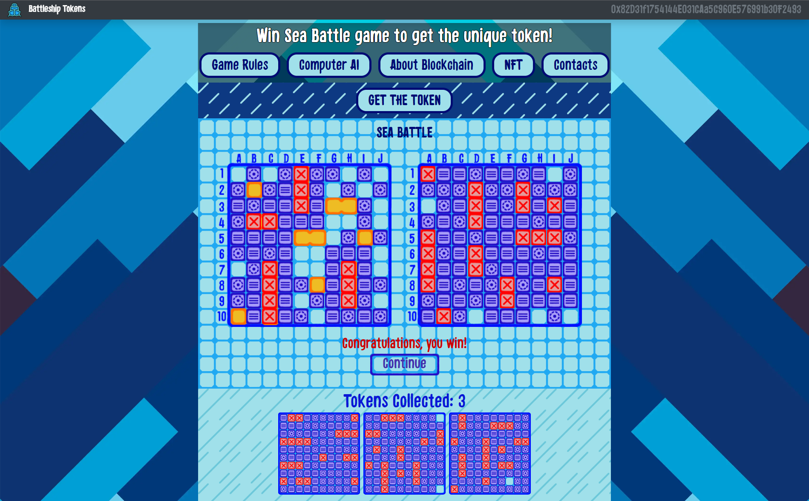
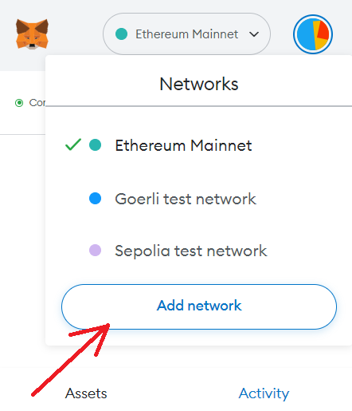
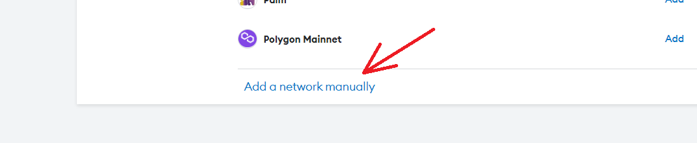
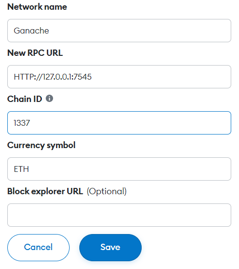
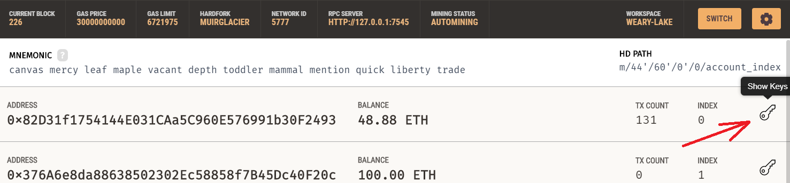
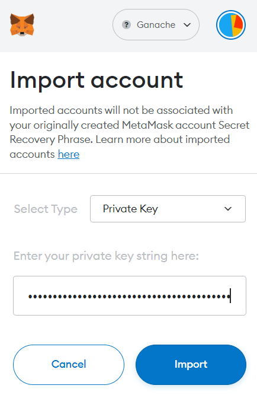

# Seabattle Blockchain Application

This innovative application combines my previous web game project with the power of blockchain technology. It features a thrilling gameplay experience with competitive seabattle AI and gives users ability to record their progress by minting and storing NFT tokens on the Ethereum blockchain, making them easily verifiable.



### Requirements

* Python 3.7+ interpriter with necessary packages:
  * [PIL](https://pillow.readthedocs.io/en/stable/) (Install by running `pip install pillow`)
  * [cv2](https://pypi.org/project/opencv-python/#files) (Install by running `pip install opencv-python`)
  * [cv2](https://flask.palletsprojects.com/en/2.2.x/installation/#install-flask) (Install by running `pip install Flask`)
* [Truffle](https://trufflesuite.com/docs/truffle/) (Install by running `npm install --g truffle@5.1.39`)
* [Ganache](https://trufflesuite.com/ganache/)
* [Node.js](https://nodejs.org/en/)
* [Metamask](https://metamask.io/) extension for Chrome

### Setting everything up

* Open the project directory using your terminal

* Get node_modules packages:
```bash
npm install
```

* Start Ganache and click ethereum quickstart (starting your virtual blockchain network)

* Set up Metamask:
  * Create your account (if you don't have one)
  * Open Networks tab and click Add network:
  
  
  
  * And then click Add network manually:
  
  
  
  * Enter the following data in Metamask:
  
  
  
  * Open Ganache, choose random address with ETH, click show keys button and copy the private key:
  
  
  
  * Click account tab in Metamask and add Ganache account via private key:
  
  
  
  * Now you have access to the account with ETH in your virtual network to pay for transactions!
  
* Run from terminal in project folder to add project smart contracts on virtual blockchain:
```bash
truffle migrate --reset
```

* And finally run the app:
```bash
npm start
```
